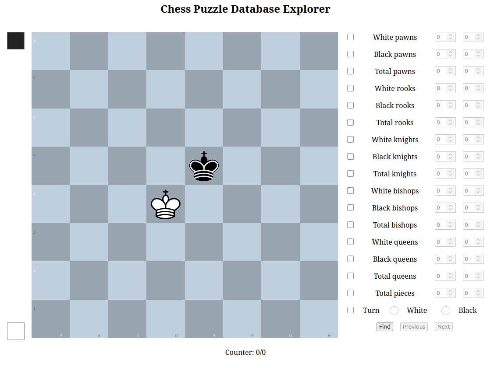
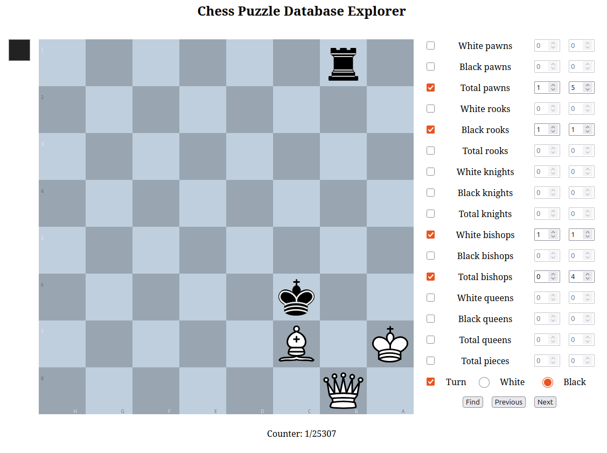

# Chess Puzzle Database explorer -- Web

A small web client for the Chess Puzzle Database explorer.

You can run a local server to explore the database via your browser, or host it online for other users to explore your databse. In either case, you have to download first the database file, and run the server by passing to it the path to the database file.

## What does it look like

The main view of the web looks like this.

Users can check the checkboxes for the pieces they want the positions to have, select the number of pieces. To see the positions, they have to click run next. For example, they can search for positions
- with a number of pawns between 1 and 5,
- with exactly 1 black rook,
- with exactly 1 white bishop,
- with a total number of bishops between 0 and 4,
- where it is black to move.
- (unchecked boxes are not used to search for positions).

In the screenshot it can be seen that there are 25.307 such positions of 5.009.706 _unique_ positions in the lichess database (downloaded May 2025).

(Note: the May 2025 lichess database contained, at the time of writing, a total of 5.037.439 of which 5.009.706 are unique).

## Compile the client code

Below are instructions to explain how to compile the typescript client code. The backend is written in C++ and can be compiled by following the instructions in the main [README](/) of this repository.

### Install all dependencies first

-   `nodejs` and `npm`

    -   _Option 1_: via `apt`

            $ sudo apt install npm
            $ sudo apt install nodejs

    -   _Option 2_: via `nvm`

        As explained in [this Stack Overflow answer](https://stackoverflow.com/questions/76421238/tsc-command-showing-syntaxerror-unexpected-token/76842486#76842486) install first `nvm`

            $ curl -o- https://raw.githubusercontent.com/nvm-sh/nvm/v0.40.1/install.sh | bash

        and then install `nodejs` using `nvm`. The version to install has to be `14.17` or newer [as per the TypeScript documentation](https://www.typescriptlang.org/docs/handbook/release-notes/typescript-5-1.html#breaking-changes). The list of versions available can be checked with the command

            $ nvm ls-remote

        To install version `v22.12.0` (which is an LTS version), run the following command

            $ nvm install 22.12.0

        This command will install `nodejs` automatically.

    To check what version of `nvm` you have installed on your system run the command

        $ nvm list

    This shows that multiple versions of `nvm` can be installed in the system.

    To check what version of `npm` you have installed on your system, run the command

        $ npm --version

-   `typescript`. You may need superuser privileges (`sudo`) to install it.

        $ npm install -g typescript

-   `ts-node`. You may need superuser privileges (`sudo`) to install it.

        $ npm install -g ts-node

-   [`esbuild `](https://esbuild.github.io/). You may need superuser privileges (`sudo`) to install it.

        $ npm install -g --save-exact --save-dev esbuild

### Install all packages required

First, navigate to the `web` directory within this repository.

    $ cd web

Then install the required packages for `chesspebase` with

    $ npm install

#### Keeping all packages up to date

The packages installed in the commands above are surely going to be updated regularly. To check which need to be updated run

    $ npm outdated

In order to update all outdated packages, run the command

    $ npm update

This command needs not be run inside the directory for `chesspebase`.

### Compile the source code

To build the backend, you can follow the _build_ instructions in the [main readme](https://github.com/lluisalemanypuig/chesspebase/README.md).

To build the front end, simply run

    $ ./build/compile.sh

## Run the server

Navigate to the build directory, say

    $ cd build-release

From there, run the server by feeding it the databases you want to host

    $ ./web/server --lichess-database lichess.csv

Notice that databases are often licensed, and the terms of the license may prevent you from sharing the contents online. If a database is not licensed, you will have to contact the creators to give you permission to share it online.
